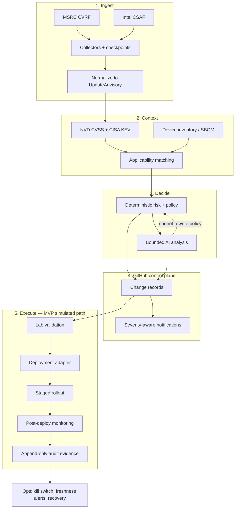
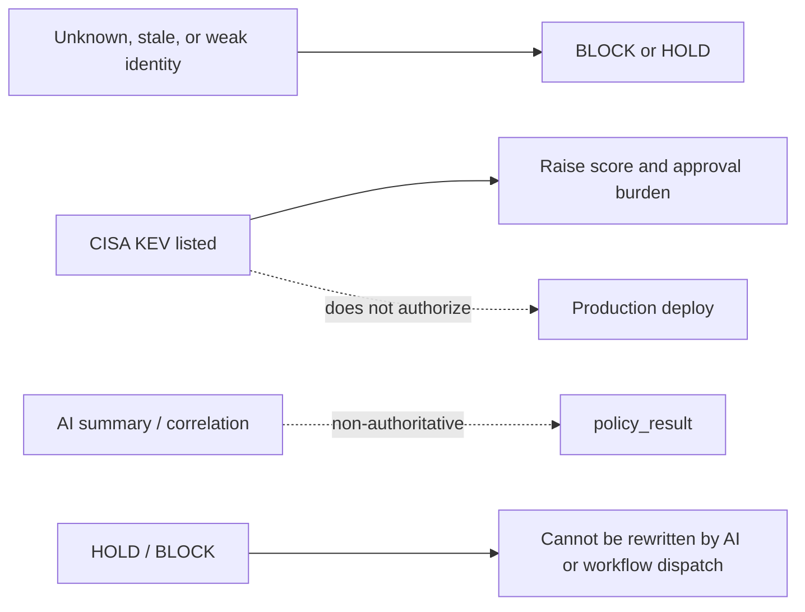
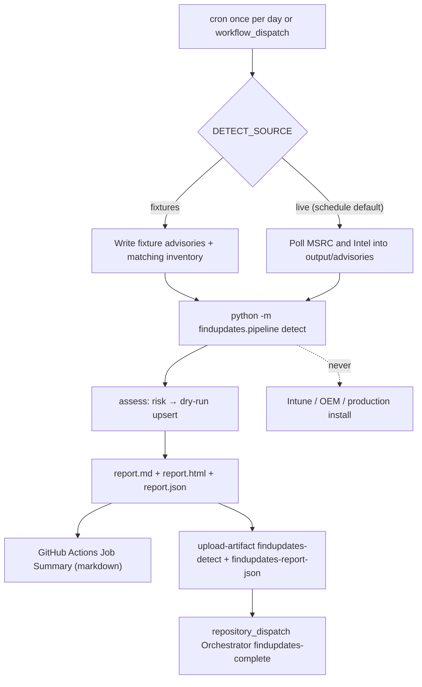

# FindUpdates

FindUpdates is a safety-conscious update intelligence and orchestration pipeline
for medical-device environments. It discovers Microsoft and Intel advisories,
matches them against managed-device inventory, computes deterministic
risk and policy, produces auditable GitHub change records, and (on the MVP
path) validates, deploys through mock adapters, and records evidence.

Product PDLC for [DesktopApplication](https://github.com/defrances/DesktopApplication)
(architecture, MDS2-lite, product vulnerability report, app patch, smoke/regression,
release zip) lives in [Orchestrator](https://github.com/defrances/Orchestrator)
workflow **PDLC patch and release**. This repository's `station_report` is host
OS/KB intelligence for workstations. It is **not** the product vulnerability
input. A later release-notes block may cite `station_report` as OS KB advice
only; Windows KBs are never packaged with the application.

**This repository is not approved for production medical-device deployment.**
Patient identifiers and PHI must never enter fixtures, logs, model prompts, or
audit artifacts. Vendor advisory text is untrusted input.

GitHub is the control plane for code, change records, approvals, and evidence.
Device updates execute only through approved deployment adapters. Agentic AI
may summarize and explain evidence; it is never authoritative for applicability,
severity, approval, or production deployment ([ADR-0003](docs/adr/0003-non-authoritative-ai.md)).

---

## How the pipeline works

The pipeline is a sequence of bounded stages. Intelligence stages
(collect → assess → notify) run locally and on GitHub Actions. Execution
stages (validation → deploy → rollout → monitor) run in the MVP demo with
simulated backends; they are not wired to live Intune or OEM agents.



Fail-closed rules sit beside every stage. Unknown must never become
`not_affected` or an empty “no updates” catalog.



### Stage notes

| Stage | What happens | Fail-closed behavior |
| --- | --- | --- |
| Collect | Poll MSRC CVRF and Intel CSAF. Write advisory JSON and checkpoints. Network failure is an outage, not “no updates”. | Malformed source data is rejected. Intel CSAF URLs are fetched only when they share the configured index host. |
| Normalize | Map vendor payloads onto the versioned `UpdateAdvisory` schema. | Unknown reboot, exploitation, and product-status values stay unknown; they are never coerced to negatives. |
| Enrich | Attach NVD CVSS and CISA KEV context. Prioritization only. | Absence from KEV is not proof of no exploitation. Outages keep last-known cache or stay unknown. Vendor `affected_products` are not overwritten. |
| Inventory + applicability | Match advisories to devices with strong product identity. | Empty, stale, or weakly identified inventory cannot yield `not_affected`. Unknown applicability is `BLOCK`. |
| Risk / policy | Versioned deterministic function of advisory, inventory, applicability, and policy. Hard gates override numeric score. | Invalid policy fails closed. Draft policy under `configs/policies/` is not production approval. |
| Bounded AI | Explain and correlate after risk. Actions may call GitHub Copilot CLI; missing seat or CLI falls back to the offline template. | AI cannot change `policy_result`, target set, or approvals. Copilot has no tools. Provider outage still emits the analysis schema. |
| Change records | One GitHub Issue (or in-memory record) per `(advisory_id, deployment_group)`. | HOLD/BLOCK cannot be overridden by a dispatch input. Promotion never runs on pull requests. |
| Notify | Fan-out on material risk, KEV, device-count, policy, or operational-failure changes. Unchanged rescans are suppressed. | Delivery failure is recorded; it does not abort assess or rewrite policy. Webhook URLs are read at request time, never stored on the record. |
| Validate → deploy → rollout → monitor | Lab profile, adapter, canary/rings, health classification. Wired in the MVP demo with mock adapters. | Required FAIL / BLOCKED / INCONCLUSIVE blocks promotion. Automatic pause is allowed; automatic rollback is not. Kill switch stops new installs without stopping collection. |

The detailed trust model lives in [docs/architecture.md](docs/architecture.md).

---

## GitHub detect path (what Actions run today)

`.github/workflows/detect.yml` is the scheduled intelligence loop. It never
deploys, never runs on pull requests, and runs **once per day** (plus
`workflow_dispatch`). The scheduled run uses `source=live`. After artifacts
upload it notifies [Orchestrator](https://github.com/defrances/Orchestrator)
with the FindUpdates run id so Orchestrator can download
`findupdates-report-json`. This job does not send email and does not create
GitHub Issues.



Companion workflows:

- `collect.yml` — dry-run collector only; not a pull-request check.
- `change-promotion.yml` — promotion from a stored change record; reads
  `policy_result` from that record; not triggered by pull requests.

---

## What is live vs simulated

| Capability | Status |
| --- | --- |
| Microsoft MSRC and Intel CSAF collectors | Implemented. Operators can poll live. GitHub `collect.yml` stays `--dry-run`. `detect.yml` polls live on the daily schedule or `workflow_dispatch` with `source=live`. |
| NVD / CISA KEV enrichment | Implemented. Optional during detect (`--enrich`). |
| Deterministic applicability, risk, policy | Implemented. |
| Bounded AI analysis | Implemented. Actions may use GitHub Copilot CLI; unavailable Copilot falls back to the offline/template provider. |
| Change-record upsert | Memory store for CI/MVP. `GitHubChangeStore` for live Issues (`--store github`). Detect always dry-runs upsert. |
| Notifications | In-memory GitHub comment formatter. Optional webhook from `FINDUPDATES_NOTIFICATION_WEBHOOK_URL`. Detect publishes a Job Summary. No live Issue-comment POST from assess/detect. |
| Lab validation, deployment, rollout, monitoring, audit | Implemented against `MockDeploymentAdapter`, `SimulatedTarget`, and simulated heartbeats in the MVP demo. |
| Live Intune / OEM firmware agents | **Out of scope.** Not implemented. |
| Acknowledgement CLI, durable notify log, WORM archive, Environment reviewers as default | Not implemented. |

---

## Development

Requires Python 3.12+.

```bash
python -m venv .venv
source .venv/bin/activate
python -m pip install --upgrade pip
python -m pip install -r requirements-dev.lock
make check
```

On Windows PowerShell, activate with `.venv\Scripts\Activate.ps1`. Set
`PYTHONPATH=src` (or `$env:PYTHONPATH = "src"`) before running operator CLIs.

Copy `.env.example` for local development. Never commit real credentials,
tokens, webhook URLs that embed secrets, or production device dumps.
Non-secret policy lives under `configs/` and changes through code review.

Runtime state such as checkpoints and detect output belongs under
`.findupdates/` (gitignored).

---

## Operator commands

All of these commands **never deploy**.

### Collect vendor advisories

```bash
python -m findupdates.collectors --dry-run --source all
python -m findupdates.collectors --source msrc --checkpoint-dir .findupdates/checkpoints --output-dir .findupdates/out
```

`--dry-run` exercises parsers without treating a live poll as a successful
empty catalog when the network fails. See [docs/collection-runner.md](docs/collection-runner.md).

### Assess against inventory

```bash
python -m findupdates.pipeline assess --advisories .findupdates/out --inventory inventory.json --output-dir .findupdates/changes --dry-run
python -m findupdates.pipeline assess --advisories .findupdates/out --inventory inventory.json --skip-enrichment --skip-notify --skip-ai
python -m findupdates.pipeline assess --advisories .findupdates/out --inventory inventory.json --store github --repository owner/repo
```

`--advisories` is collector output (`msrc/*.json`, `intel/*.json`) or a single
advisory file. `--inventory` is one device, a `{ "devices": [...] }` catalog,
or a JSON array. Empty catalogs fail closed.

`--dry-run` writes change-record JSON when `--output-dir` is set and performs
no GitHub HTTP. Per-device analysis JSON plus the run-level Agentic AI
briefing (`analysis/updates.md`, `analysis/run.json`) land under
`--output-dir/analysis/`. Notification JSON lands under
`--output-dir/notifications/`.

See [docs/pipeline-assess.md](docs/pipeline-assess.md).

### Detect, analyze, and notify

```bash
python -m findupdates.pipeline detect --source fixtures --output-dir .findupdates/detect
python -m findupdates.pipeline detect --source live --inventory configs/inventory/synthetic-workstations.json --output-dir .findupdates/detect
```

Fixture mode writes synthetic advisories and the synthetic workstation catalog
(refreshed timestamps). Live mode requires `--inventory` and polls MSRC/Intel.
Detect always dry-runs change-record upsert. Pass `--enrich` to run NVD/CISA KEV.

On GitHub: **Actions → Detect updates → Run workflow**. Scheduled detect is
**once per day at 06:17 UTC** and always uses `source=live`. Manual runs keep
`fixtures` as the dispatch default. Live uses
`configs/inventory/synthetic-workstations.json`. The Job Summary leads with
per-station markdown (package, explanation, official URL) and is not an
install authorization. Open `report.html` in the artifact for the English HTML
report, or download `findupdates-report-json` for `report.json` (listed station
rows, counts, official URLs). After upload, detect always notifies Orchestrator
(`findupdates-complete`) with the run id. Orchestrator emails results. Detect
does not send email and does not create GitHub Issues. Store
`ORCHESTRATOR_PAT` in FindUpdates Actions secrets (Contents write on
Orchestrator). Live collection uses a **45-day** lookback so one run covers a
Patch Tuesday plus the prior month without a full historical MSRC dump. GitHub
Actions uploads one `.tgz` archive plus a separate JSON report artifact.
Artifacts are retained for 14 days.

### MVP end-to-end demo

The demo runs the full lifecycle on synthetic Microsoft and Intel fixtures
plus a non-PHI imaging workstation. Mock adapters stand in for production
backends. It is an acceptance test, not a production authorization.

```bash
python -m unittest tests.integration.test_mvp -v
```

Expected happy path: the Microsoft advisory applies, risk requires approval,
offline AI explains without changing policy, a change record is stored,
validation PASSes, staged rollout reaches `succeeded`, and an evidence bundle
verifies. See [docs/mvp.md](docs/mvp.md).

---

## Repository layout

```text
src/findupdates/          Application packages
  collectors/             Vendor/source ingestion and polling runner
  normalization/          Canonical advisory normalization
  enrichment/             NVD CVSS and CISA KEV context
  inventory/              Device inventory and SBOM handling
  applicability/          Deterministic device/update matching
  risk/                   Risk scoring and policy evaluation
  agents/                 Bounded AI analysis layer
  notifications/          Severity-aware notification adapters
  changerecords/          GitHub/in-memory change records and promotion
  pipeline/               assess + detect operator CLIs
  validation/             Lab validation plans and simulated targets
  deployment/             Approved deployment backend adapters
  rollout/                Staged canary/ring promotion
  monitoring/             Post-deploy health, pause and gated rollback
  audit/                  Evidence and audit trail
  ops/                    Kill switch, metrics, freshness alerts, recovery
  mvp/                    Fixture-driven end-to-end demo runner
configs/                  Version-controlled non-secret configuration
schemas/                  Versioned JSON Schemas
tests/                    Unit, integration and fixtures
docs/                     Architecture, ADRs, and stage manuals
.github/                  CI, detect/collect/promotion workflows
```

---

## Documentation

| Topic | Document |
| --- | --- |
| Architecture and trust model | [docs/architecture.md](docs/architecture.md) |
| Collect | [docs/collection-runner.md](docs/collection-runner.md), [docs/microsoft-ingestion.md](docs/microsoft-ingestion.md), [docs/intel-ingestion.md](docs/intel-ingestion.md) |
| Assess / detect | [docs/pipeline-assess.md](docs/pipeline-assess.md) |
| Advisory schema | [docs/update-advisory.md](docs/update-advisory.md), [ADR-0001](docs/adr/0001-unknown-states-in-advisory-schema.md) |
| Inventory and applicability | [docs/inventory.md](docs/inventory.md), [docs/applicability.md](docs/applicability.md) |
| Enrichment | [docs/enrichment.md](docs/enrichment.md) |
| Risk and policy | [docs/risk-policy.md](docs/risk-policy.md), [ADR-0002](docs/adr/0002-deterministic-risk-policy.md) |
| Bounded AI | [docs/agents.md](docs/agents.md), [ADR-0003](docs/adr/0003-non-authoritative-ai.md) |
| Change records | [docs/change-records.md](docs/change-records.md), [ADR-0004](docs/adr/0004-github-control-plane.md) |
| Notifications | [docs/notifications.md](docs/notifications.md), [ADR-0005](docs/adr/0005-severity-aware-notifications.md) |
| Validation through ops | [docs/validation.md](docs/validation.md), [docs/deployment.md](docs/deployment.md), [docs/rollout.md](docs/rollout.md), [docs/monitoring.md](docs/monitoring.md), [docs/audit.md](docs/audit.md), [docs/operations.md](docs/operations.md) |
| Threat model | [docs/threat-model.md](docs/threat-model.md) |
| Contributing | [CONTRIBUTING.md](CONTRIBUTING.md) |

Engineering work is tracked under [EPIC #5](https://github.com/defrances/FindUpdates/issues/5).
Work from a GitHub issue, keep safety-critical decisions deterministic and
testable, and run `make check` before opening a pull request.

---

## Status

Early foundation/MVP development. Collect, assess, detect, bounded AI, and
GitHub Job Summary notification are implemented. Live production backends are
not. **Not approved for production medical-device deployment.**
